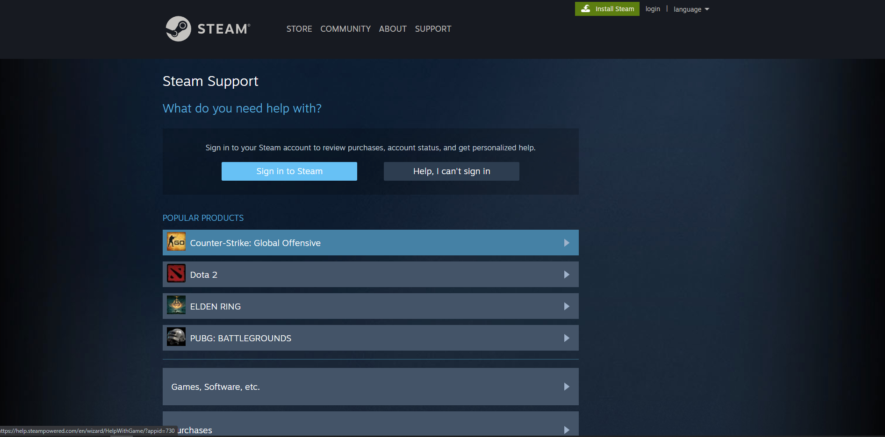

# Comprovação informal

## 1. Introdução

&emsp;&emsp;Validação de software ou, mais genericamente, verificação e validação (V&V), tem a intenção de mostrar
que um software se adequa a suas especificações ao mesmo tempo que satisfaz as especificações do cliente
do sistema. Teste de programa, em que o sistema é executado com dados de testes simulados, é a principal
técnica de validação. A validação também pode envolver processos de verificação, como inspeções e revisões,
em cada estágio do processo de software, desde a definição dos requisitos de usuários até o desenvolvimento
do programa. Devido à predominância dos testes, a maior parte dos custos de validação incorre durante e após
a implementação.

## 2. Metodologia

&emsp;&emsp;A estratégia adotada pelo grupo foi a elaboração dessa comprovação informal onde os contribuidores tentam contactar a equipe de desenvolvedores e envolvidos da plataforma steam para realizar a  tarefa de leitura de descrições e uso do cliente, assim podendo solucionar possíveis problemas na expressão de requisitos. 

## 3. Comprovação informal

### 3.1 Comunicações Satisfatorias 

&emsp;&emsp; Até o periodo de entrega desta atividade todos os contatos no app e no site não tiveram êxito em estabelecer comunicação. 

### 3.2 Comunicações Não Satisfatorias

&emsp;&emsp; via site steam

## 4. Histórico de versão

| Versão | Data       | Descrição                                           | Autor        |
| ------ | ---------- | --------------------------------------------------- | ------------ |
| 0.1    | 22/03/2022 | Criaçao dos textos e explicação da metodologia | Matheus Monteiro