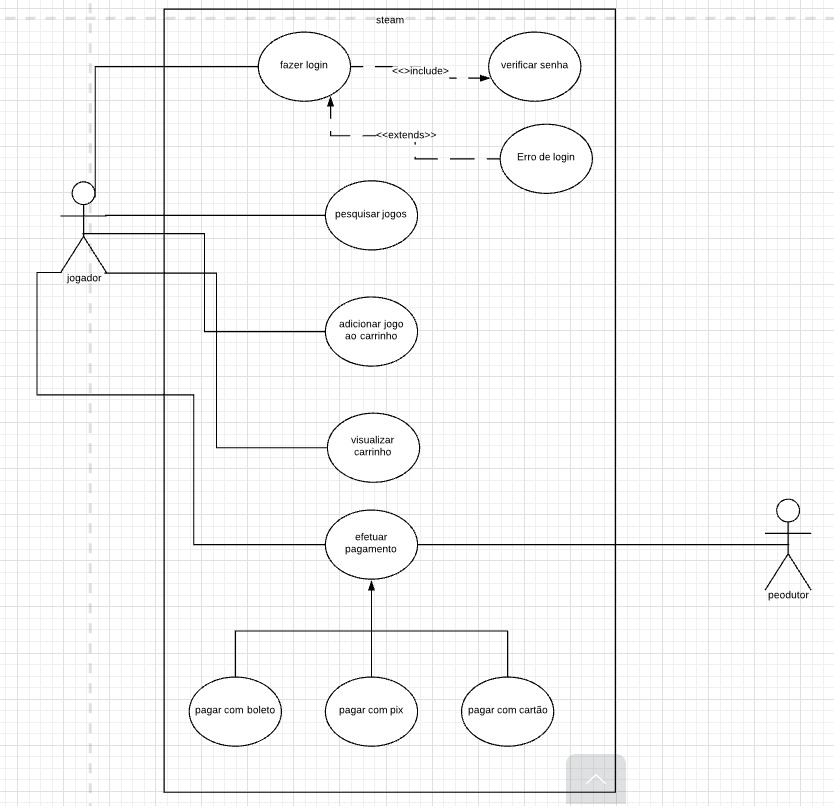
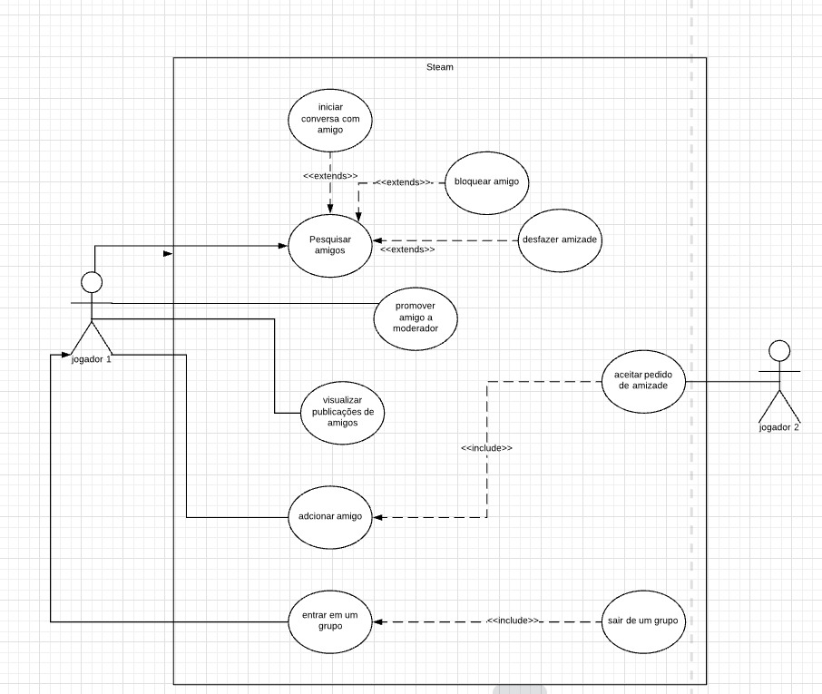
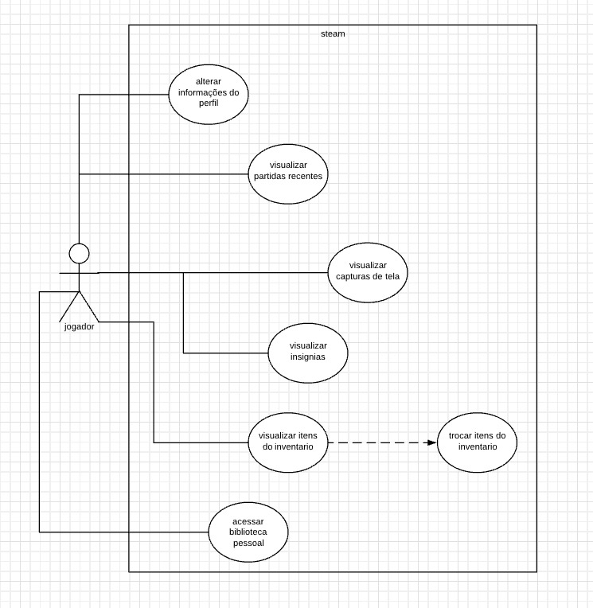
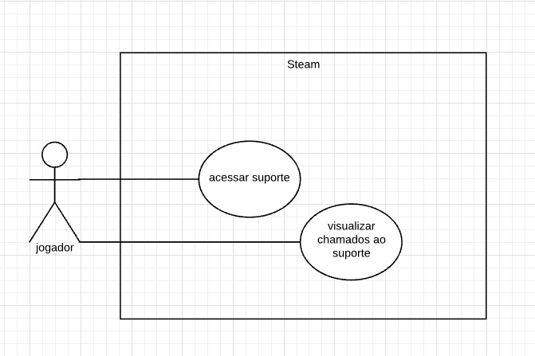

# __Casos de Uso__

## 1. Introdução

&emsp;&emsp;Os casos de uso são uma representação do fluxo de ações executadas no sistema, envolvendo usuários entre si e o próprio sistema. Se faz necessário a clareza e objetividade em sua descrição. Importante também que agregue valor aos interessados no sistema.

## 2. Diagramas de Caso de Uso
&emsp;&emsp;Diagramas comportamentais, caso de uso ou use case irão explicitar as relações e ações executadas entre usuários no sistema. O diagrama de caso de uso é composto por bonecos de palitinho que representam os atores, elipses definem as ações ocorridas entre os envolvidos, essas são sempre nomeadas com substantivos pois são as ações, retas são as associações, já os relacionamentos serão setas. Include: É a interação de dois casos de uso onde um é dependente do outro e precisa ser executado quando chamado pelo anterior, será representado por linha pontilhada com a seta apontada para o caso de uso dependente e acompanhada do rótulo: << include >>. Extend: A mesma representação do include será usada para o relacionamento entre dois casos de uso em que o estendido pode ou não ser acionado, agora usando a palavra extend no rótulo << extend >> e tendo a seta apontada para o caso de uso que se estende. Generalization ainda são dois casos de uso em uma situação onde B generaliza A, B executará todoas as suas especificações e as de A. 

## 3. Diagramas

## 3.1 Fluxo de login
 
| UC1                   | Informações |
| :-----                | :---------- |
| Descrição             |  O usuário deve ser capaz de realizar login           |
| Pré condições         | Ter uma conta            |
| Ator                  |    usuário         |
| Ação                  |    O usuário acessa sua conta ultilizando login e senha         |
| Fluxo principal       |     <li> O usuário acessa o aplicativo </li>  <li> O usuário insere seu login e senha  <li> O usuário acessa sua conta </li>        |
| Pós condições         |   O usuário poderá aproveitar as funções da aplicação         |
|                       |             |
## 3.2 Fluxo de Interação
 
| UC2                   | Informações |
| :-----                | :---------- |
| Descrição             |  O usuário deve ser capaz de interagir com outros usuários           |
| Pré condições         |   Ter amigos em sua conta          |
| Ator                  |    Usuário         |
| Ação                  |    O usuário envia mensagens à um amigo        |
| Fluxo principal       |     <li> O usuário acessa o aplicativo </li>  <li> O usuário pesquisa um amigo  <li> O usuário envia a mensagem desejada </li>        |
| Pós condições         |   O usuário poderá conversar com amigos           |
|                       |             |
## 3.3 Fluxo de configurações
 
| UC3                   | Informações |
| :-----                | :---------- |
| Descrição             |  O usuário deve ser capaz de fazer alterações em seus dados |
| Pré condições         |   Ter uma conta         |
| Ator                  |    Usuário         |
| Ação                  |    O usuário altera dados cadastrados em seu perfil       |
| Fluxo principal       |     <li> O usuário acessa seu perfil na aplicação </li>  <li> O usuário altera os dados  <li> O usuário salva as alterações </li>        |
| Pós condições         |   O usuário poderá ter seus dados atualizados           |
|                       |             |
## 3.4 Fluxo de suporte
 
| UC4                   | Informações |
| :-----                | :---------- |
| Descrição             |  O usuário deve ser capaz de abrir um chamado de suporte          |
| Pré condições         |   Ter tido problemas em sua conta         |
| Ator                  |    Usuário         |
| Ação                  |    O usuário abre um chamado ao suporte       |
| Fluxo principal       |     <li> O usuário acessa o aplicativo </li>  <li> O usuário acessa a área de suporte  <li> O usuário descreve o problema </li>  <li> O usuário acessa a área de suporte  <li> O usuário envia o chamado </li>      |
| Pós condições         |   O usuário poderá solucionar o problema           |
|                       |             |

## 4. Bibliografia

<li>SERRANO, Maurício; SERRANO, Milene; Requisitos - Aula 13</li>
<li>Lucidchart Português, Tutorial de Caso de Uso UML, YouTube, 25 abril 2019, Disponível em: https://www.youtube.com/watch?v=ab6eDdwS3rA</li>

## 5. Histórico de versão

| Versão | Data       | Descrição                                           | Autor           |
| ------ | ---------- | --------------------------------------------------- | ------------    |
| 0.1    | 04/03/2022 | Criação do documento                                | Ingrid Carvalho |
