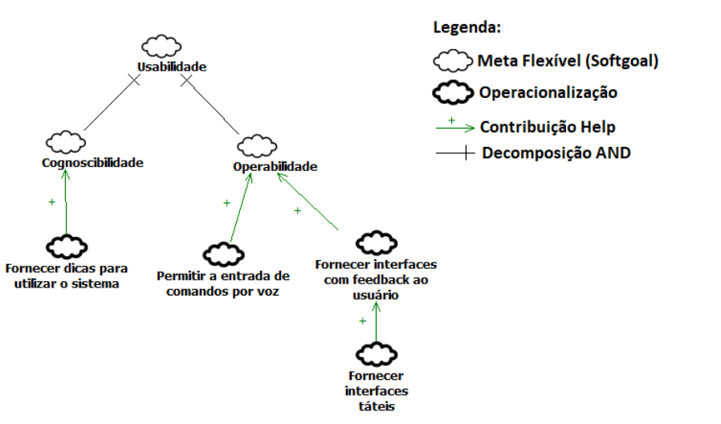
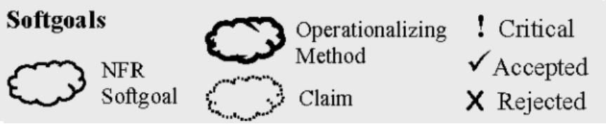
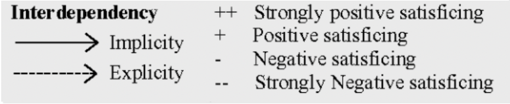
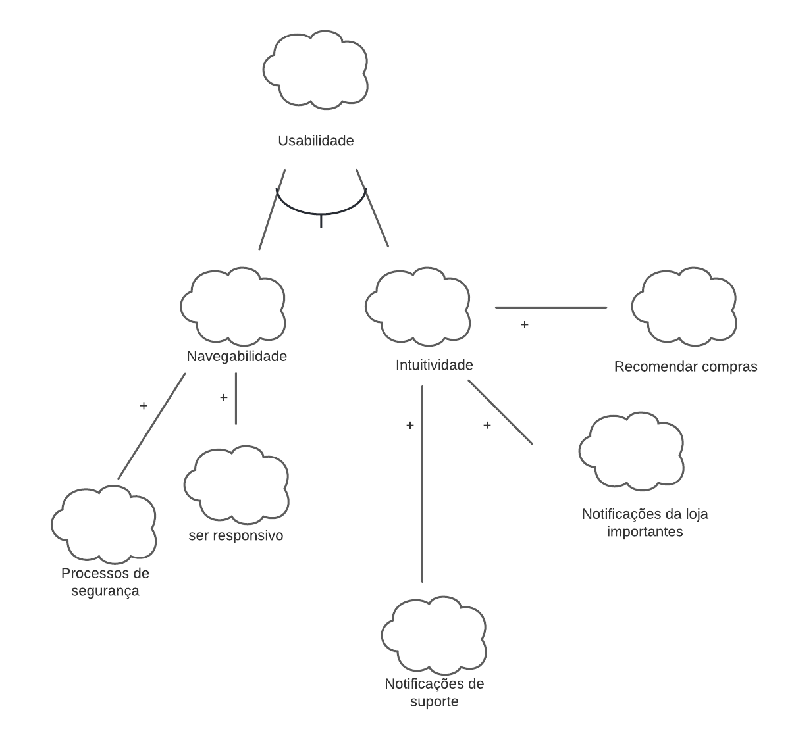
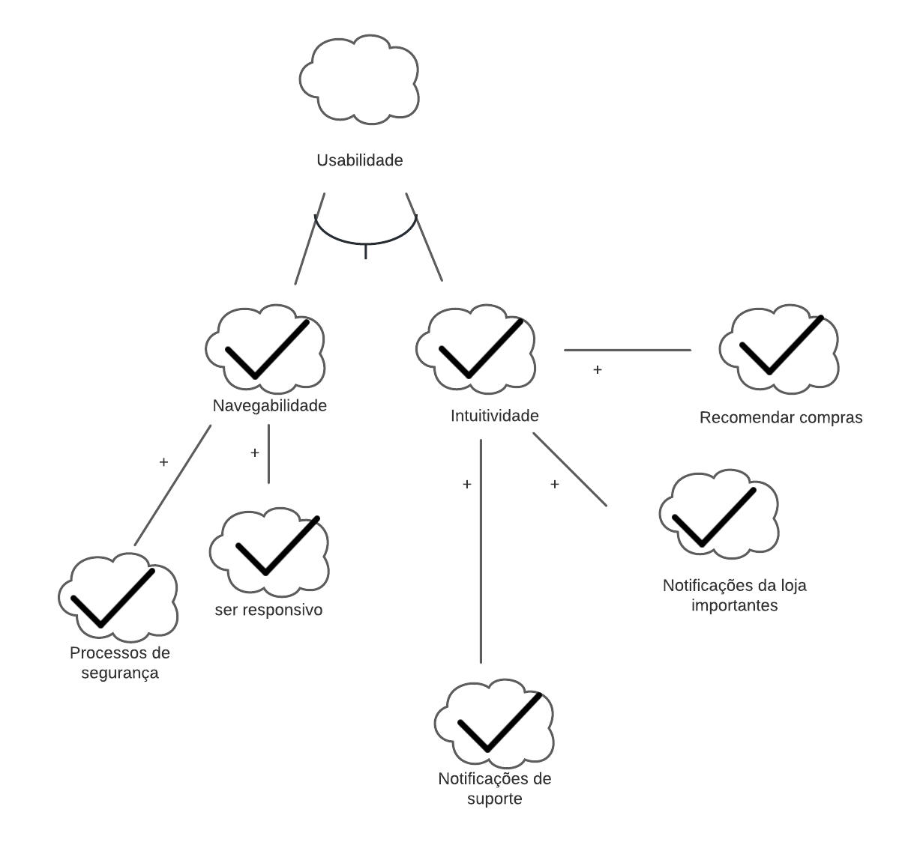

# NFR Framework

## 1. Introdução
&emsp;&emsp;"O NFR Framework é uma abordagem para representar e analisar Requisitos Não-Funcionais. Seu objetivo é ajudar desenvolvedores na implementação de soluções personalizadas, levando em consideração as características do domínio e do sistema em questão. Tais características incluem Requisitos Não-funcionais, Requisitos funcionais, prioridades e carga de trabalho. Esses fatores determinam a escolha de alternativas de desenvolvimento para um determinado sistema (CHUNG et al., 2000)" (SILVA, 2019, p. 30).

&emsp;&emsp;Além disso, a implementação representa o NFR como um soft target, que é a unidade básica para expressar requisitos não funcionais. Possui interdependências entre seus alvos flexíveis, fornece técnicas operacionais e fornece um catálogo para inferir possíveis interações.

## 2. Metodologia
&emsp;&emsp;O núcleo inicial desse documento é definir as funções dos requisitos não-funcionais utilizando técnicas e ferramentas como diagramas utilizando o NFR framework para criar os casos de análises das possíveis situações.

## 3. Requisitos não funcionais
&emsp;&emsp;A seguir apresentamos os requisitos não funcionais recolhidos na etapa de elicitação do sistema. Os mesmos requisitos serão utilizados para a confecção do NFR Framework.

| Número | Requisito | Técnica        |
| :------: | ---------- | :---------------------------------------------------: |
| RNF1 | O aplicativo tem que ser responsivo | Brainstorm |
| RNF2 | O aplicativo deve notificar os usuario | Brainstorm |
| RNF3 | O aplicativo deve ser seguro | Brainstorm |
| RNF4 | O aplicativo deve recomendar compras para o usuario | Brainstorm |
| RNF5 | O aplicativo deve notificar andamento do processo de recurso | Brainstorm |

<figcaption>Tabela 1: Requisitos não funcionais.</figcaption>

## 4. Legenda

<figcaption>Imagem 1: Legenda dos elementos aplicados em exemplo praticode definição do NFR Framework</figcaption>

<figcaption>Imagem 2: Legenda dos elementos de definição do NFR Framework</figcaption>

<figcaption>Imagem 3: Legenda dos elementos de relacionamento do NFR Framework</figcaption>

## 5. Diagramas

&emsp;&emsp; Diagramas a seguir tem o intuito de demonstrar como pode a divisão do requisitos não funcionais pode ficar clara e simples, alocando cada um em um grupo especifico, grupo esse que é sub-grupo do todo maior usabilidade. 

### 5.1 Usabilidade

<figcaption>Imagem 4: Diagrama NFR Framework de Usabilidade</figcaption>

### 5.1.1 Diagrama com propagação

<figcaption>Imagem 5: Diagrama NFR Framework de Usabilidade com propagação</figcaption>

## 6. Bibliografia

> - SILVA, Reinaldo Antônio da. NFR4ES:Um Catálogo de Requisitos Não-Funcionais para Sistemas Embarcados. Recife, 201
> -  Castro, Jaelson. UFPE: O FrameWork NFR
## 7. Histórico de versão

| Versão | Data       | Descrição                                           | Autor        |
| ------ | ---------- | --------------------------------------------------- | ------------ |
| 0.1    | 09/03/2022 | Criação da documentação              | Matheus Monteiro |