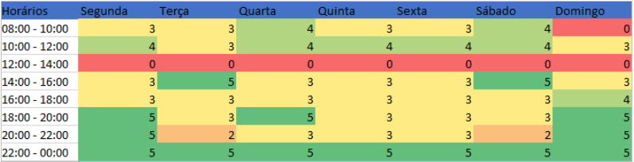

# Cronograma

## 1. Introdução
  Analisando horários semestrais, prazos de disciplinas e disponibilidade de membros, foi elaborado um cronograma, dividido em fases para realização de atividades e criação de artefatos.
## 2. Cronograma de atividades

| Etapas | Título       | Data                                           | Descrição        | Apresentação        |
| :------: | :----------: | :---------------------------------------------------: | :------------: | :------------: |
| I    | Planejamento | 27/01 ~ 08/02 | Planejamento do projeto e RichPicture | 08/02 |
| II    | Elicitação | 10/02 ~ 22/02 | Técnicas e Priorização | 22/02 |
| III    | Modelagem de Requisitos | 24/02 ~ 08/03 | Cenários, Léxico, Casos de Uso e Especificação Suplementar | 08/03 |
| IV    | Modelagem de Requisitos - Ágil | 09/03 ~ 10/03 | Histórias de Usuário, Backlog e NFR Framework | 10/03 |
| V    | Análise de Requisitos | 15/03 ~ 24/03 | Verificação & Validação | 24/03 |
| VI    | Pós-Rastreabilidade | 29/03 ~ 05/04 | Gerência de Desenvolvimento de Software orientada à baseline de Requisitos | 05/04 |
| VII    | Apresentação final | 07/04 ~ 26/04 | Conclusão do projeto | 26/04 ~ 03/05 |

<figcaption>Tabela 1: Cronograma de atividades.</figcaption>

## 3. Mapa de calor

&emsp;&emsp;Para organizar as reuniões do grupo, utilizamos um mapa de calor para verificar a disponibilidade de horário dos integrantes do grupo. Os integrantes do grupo adicionaram em uma planilha os horários que estavam livres e ocupados, e a partir das informações, foi gerado uma planilha com os horários. 

<figcaption>Imagem 1: Mapa de calor do grupo.</figcaption>

## 4. Histórico de versão

| Versão | Data       | Descrição                                           | Autor        |
| ------ | ---------- | --------------------------------------------------- | ------------ |
| 0.1    | 06/02/2022 | Criação da introdução | Matheus Monteiro |

