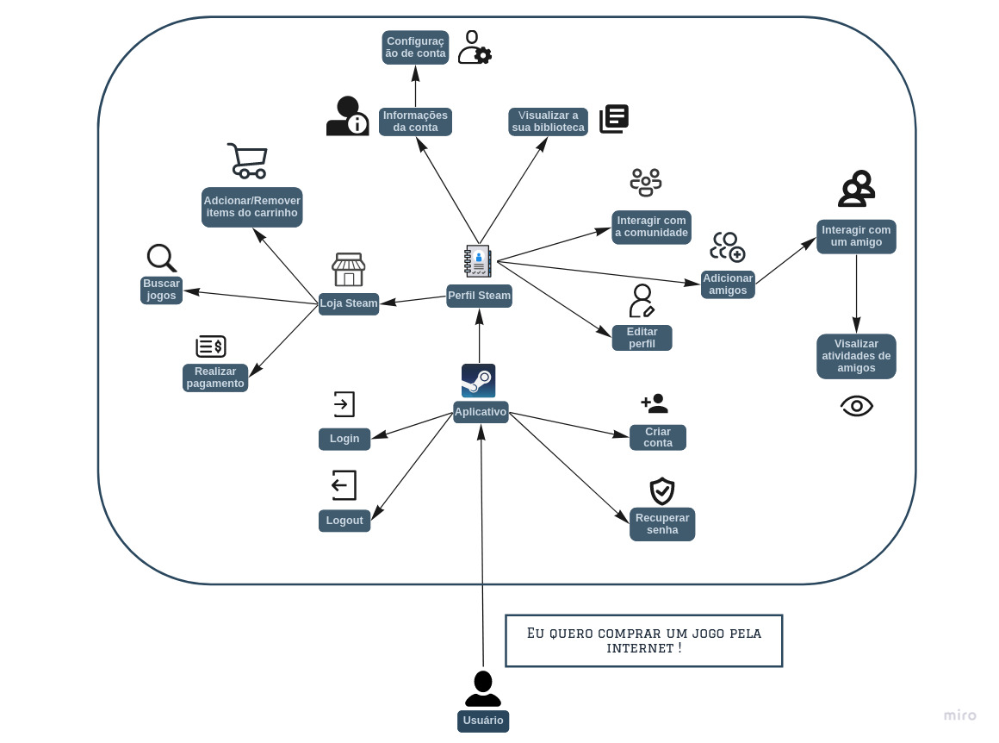
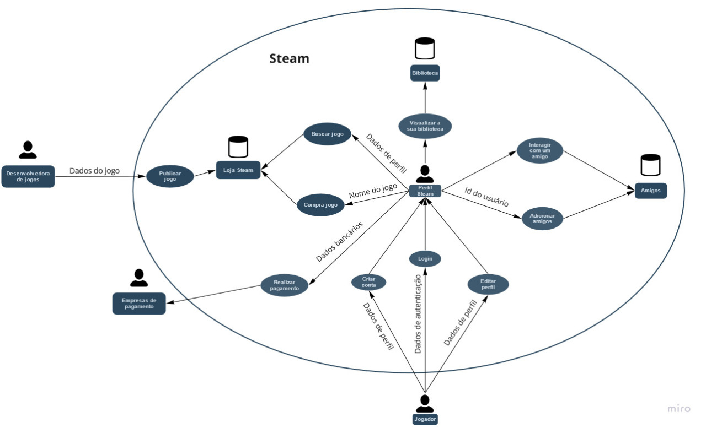
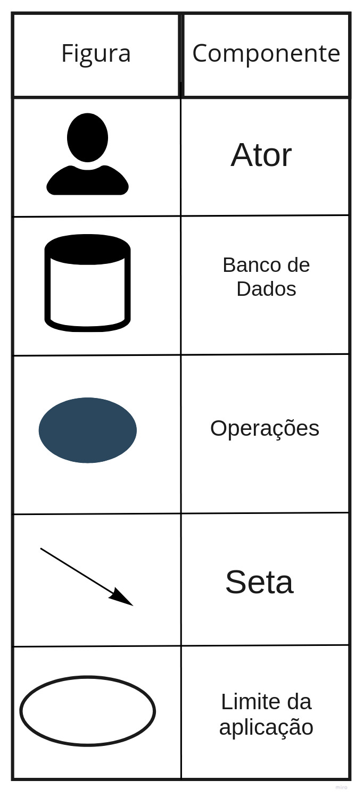

# Rich Pictures

## 1. Introdução
O Rich Picture é uma ferramenta efetiva com uma linguagem acessível, em que, se permiti analisar problemas e expressar ideias de maneira simples, por conta de sua notação. Essa ferramenta ajuda no processo de identificação de requisitos e de processos de negócios, os atores do projeto e os relacionamentos e responsabilidades dos atores com os processos.

## 2. Versões do Rich Picture

### 2.1 Versão 0.1

<figcaption>Imagem 1: Rich Picture versão 1.</figcaption>

### 2.2 Versão 1.0
Considerando as considerações feitas pela monitora, o time descidiu realizar algumas alterações para atender melhor o que foi solicitado na disciplina.

<figcaption>Imagem 2: Rich Picture versão 2.</figcaption>

### 2.2.1 Legenda
Para um melhor entendimento do Rich Picture, foi utilizada uma legenda, própria do projeto, como podemos ver na imagem abaixo.

<figcaption>Imagem 3: Legenda do Rich Picture versão 2.</figcaption>

## 3. Histórico de versão

| Versão | Data       | Descrição                                           | Autor        |
| ------ | ---------- | --------------------------------------------------- | ------------ |
| 0.1    | 06/02/2022 | Criação da introdução | Mateus Maia |
| 0.2    | 17/02/2022 | Criação do Rich Picture | Ingrid Carvalho , Mateus Maia e Rhuan Marques  |
| 0.3    | 17/02/2022 | Evolulção do Rich Picture | Mateus Maia e Matheus Monteiro |

